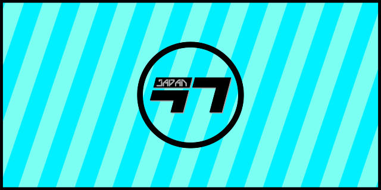
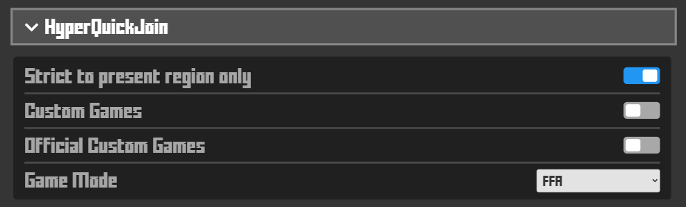
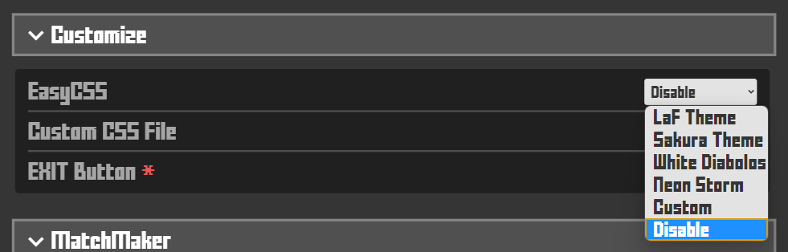
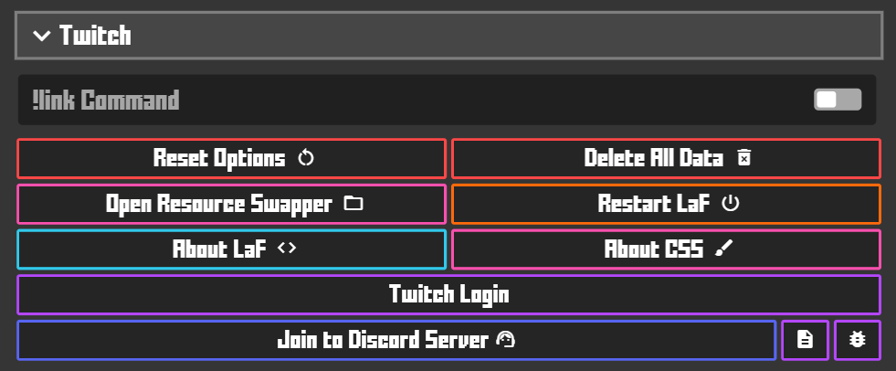

# LaF Client for Krunker

 

 

**Join our Discord: **

言語/Language: [English](https://github.com/LaFClient/LaF/blob/master/README.md) | [日本語](https://github.com/LaFClient/LaF/blob/master/README_JA.md)

## What is LaF?
**LaF = Lite and Fast** 
Krunker.io isn't a very heavy game, but there are people who still struggle to get good performance due to a low-spec PC,
 
LaF is lite and isnt like other clients with bogged down heavy features. the goal of LaF is to solve that issue! LaF is built to give low-spec PC's
 
a chance at good performance in the game.

## How to install
1. Download the [latest release](https://github.com/LaFClient/LaF/releases/latest).\
**Tip:** Download the file for your pc by referring the table, select accordingly

|   OS    | Architecture |            File Name            |
| :-----: | :----------: | :-----------------------------: |
| Windows |    64bit     |    LaF_Setup_Windows_x64.exe    |
|  macOS  |    64bit     |     LaF_Setup_macOS_x64.dmg     |
|  Linux  |    64bit     | LaF_Setup_Linux_x86_64.AppImage |

1. Run the file you downloaded.\
**Tip:** Even if your pc shows 'Windows protected your pc', don't worry. This program has no ransomware. Please press 'Run anyway' to continue the installation.

3. Follow the dialog.\
**Tip:** I don't recommend changing the set install path. But if you have to change it in for some reasons, you can change it.

## About ResourceSwapper
- Path: `%HOMEPATH%\Documents\LaFSwap`
- You can use it the same as other client's swappers. Please set the file's to `MOD`.

## About HyperQuickJoin

- You can join to your favorite gamemode with F4![^1]

## About EasyCSS
\
EasyCSS is a system that allows you to load custom css's easier.
 
You don't have to use resource swapper anymore. And you don't need to restart the client when swapping.

## Twitch !link command

1. Login to Twitch in settings
2. Your viewer can use `!link` command in stream.

### Tips
- You can toggle whether `!link` command is enable with the button.

## KeyBinds
|  Key  |         Function         |
| :---: | :----------------------: |
|  F4   |   Jump to new game[^1]   |
|  F5   |          Reload          |
|  F6   | Jump to new game(Random) |
|  F7   |         Copy URL         |
|  F8   |  Open URL in clipboard   |
|  F12  |      Open Dev Tools      |

[^1]: You can specify gamemode/region in the client settings.

## Requirements
|         |             Least             |          Recommended          |
| :-----: | :---------------------------: | :---------------------------: |
|   OS    |        Windows7 32bit         |        Windows10 64bit        |
|   CPU   |     2.33GHz x86 Processor     |     3.5GHz x86 Processor      |
|   RAM   |              4GB              |              8GB              |
| Network | Broadband Internet Connection | Broadband Internet Connection |
| Storage |             100MB             |              2GB              |
|  Memo   |      720p60 Low Settings      |     1080p60 High Settings     |

## About Developers

### Hiro527 / **Client Dev, Designer**
Web: [ぬる/Hiro](https://hiro527.github.io/)\
GitHub: [Hiro527](https://github.com/Hiro527)\
Twitch: [nulla1m](https://twitch.tv/nulla1m)\
Twitter: [ぬる / Hiro](https://twitter.com/nullA1m)\
Discord: nullA1m#7777\
Discord Server: [Hiro.js](https://discord.gg/9M9TgDRt9G)

### sh / **Client Dev, A cat**
GitHub: [shaaaaaQ](https://github.com/shaaaaaQ)

### NamekujiLSDs / **CSS Maker, Designer**
Web: [Namekuji](https://namekujilsds.github.io/)\
GitHub: [NamekujiLSDs](https://github.com/NamekujiLSDs)\
YouTube: [Namekuji Krunker / ナメクジさん](https://www.youtube.com/channel/UCH65I7YbpEK7B8-Wkr75CJQ)\
Twitter: [@NamekujiLSDs](https://twitter.com/namekujilsds)\
Discord Server: [Sluggy Lounge | Krunker ingame content](https://discord.gg/qusjZSbXQX)
